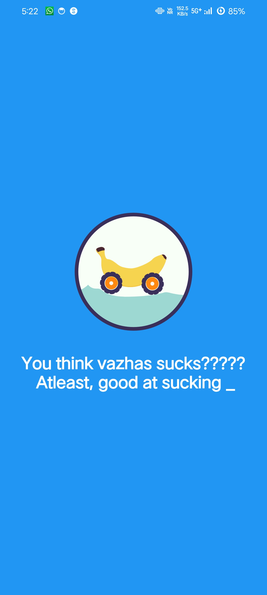
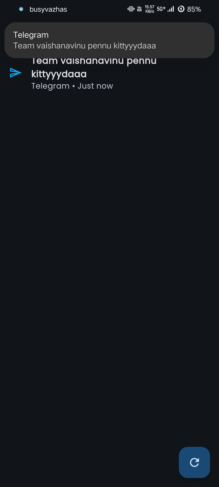
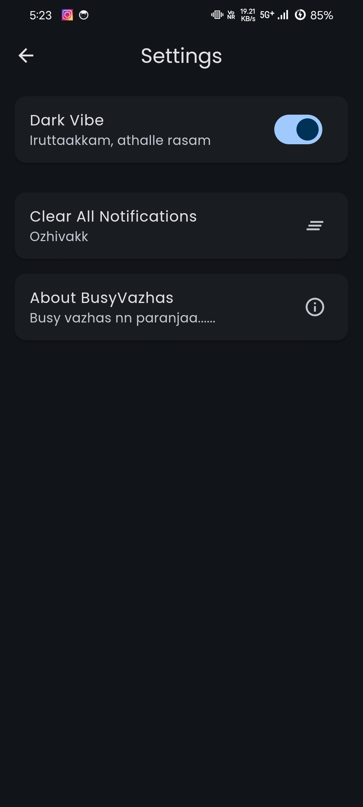

# BusyVazhas 🎯

### Basic Details
- **Team Name**: Vazha
- **Team Members**:
  - Adarsh Polsey - St. Joseph’s College, Devagiri (Master of Being “Busy”)
  - Ayush Jose - St. Joseph’s College, Devagiri (Notification Wizard)
  - Ashin Sabu - St. Joseph’s College, Devagiri (Chief of Randomness)

### Project Description
- **BusyVazhas** is a groundbreaking app that generates utterly pointless notifications to help you look like the busiest person alive. Need an excuse to avoid a meeting? Done. Want to look important while doing absolutely nothing? We got you! With BusyVazhas, no one will ever suspect you’re just staring blankly into space.

---

### The Problem (that doesn’t exist)
- **Too much peace and quiet**. People are getting judged for appearing relaxed, even though they’re probably drowning in existential dread. Whether you’re trying to dodge that nosy aunt or avoid your professor's gaze, you need *something* to look at on your screen—preferably something absurd.

---

### The Solution (that nobody asked for)
- BusyVazhas is here to keep your phone buzzing, vibrating, and demanding attention like an overactive toddler. With notifications like “Your favorite sandwich is 89% complete” or “New friend suggestion: Your Couch,” you’ll always look like you're handling critical business, even if the business is *complete nonsense*.

---

## Technical Details

- **Technologies/Components Used:**
  - **Software**:
    - **Languages**: Dart, because we’re all about “darting” away from real responsibilities.
    - **Frameworks**: Flutter, to make our nonsense run *smoothly*.
    - **Libraries**: Flutter Local Notifications, to fill your life with alerts you absolutely don’t need.
    - **Tools**: Android Studio, Visual Studio Code, and an unhealthy amount of coffee.

---

## Implementation

- **Installation**: 
   - `flutter pub get` — so you can get all the junk we threw into this app
   - `flutter packages upgrade` — because your app should be up-to-date with all the latest fake alert features.

- **Run**:
   - `flutter run` — get ready to be spammed into oblivion.

---

## Project Documentation

### Screenshots
1. **Main Screen**  
     
   _Where users embark on a journey to look busy.

2. **Home Screen**  
     
   Features include choosing notification types!”_

3. **Settings Screen**  
     
   _Adjust your “busy” frequency—everything from “Barely Interested” to “CEO of the Universe.”_

## Project Demo

- **Video**: 
  
- **Additional Demos**:
  - *“Dark mode”: Perfect for when you need to look like you're plotting world domination without the glare.”*
  - *“Clear notifications”: Because sometimes you just need to make room for more important nonsense.”*
  - *“Start/Stop notifications”: For those moments when the fake busy signals go into overdrive—hit pause before someone catches on!”*

---

## Team Contributions
- **Adarsh Polsey**: Led the team, managed design and settings layout, and ensured notifications achieved peak ridiculousness.
- **Ayush Jose**: Programmed the random notification generator and contributed his extensive knowledge of “weird things people might click on.”
- **Ashin Sabu**: Integrated the notification library and enhanced the absurdity of the app, specializing in *random* randomness.
